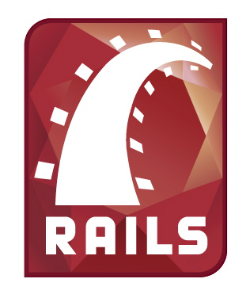

!SLIDE
# Ruby on Rails Training #

## By: Girish Sonawane ##

!SLIDE bullets incremental

# About me #

* Girish Sonawane
* 
* 

~~~SECTION:notes~~~

* 15 yo experience
* first skyscape employee

~~~ENDSECTION~~~

!SLIDE
# About me #

* girish@cuberoot.in
* @girishso

!SLIDE bullets incremental
# Contents #
* Politics
* Bring youth in politics
* 
* Women empowerment

!SLIDE bullets incremental
# Contents #
* Ruby
* Ruby on Rails
* Rails Hands On

!SLIDE bullets incremental
# What's not covered #
* Various Ruby Implementations
* Managing multiple Rubies
* SASS, CoffeeScript
* Nested forms
* Deploying Rails apps

