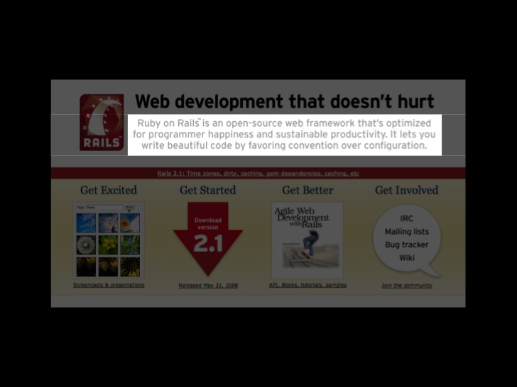
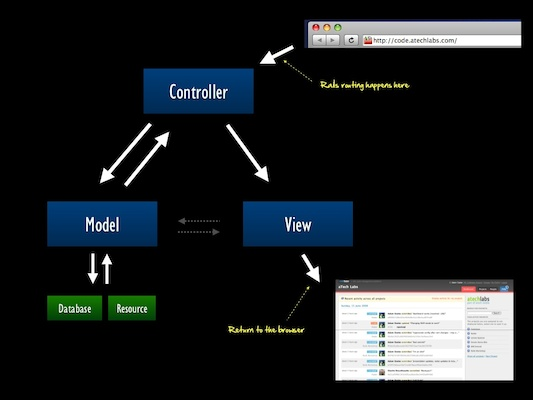

!SLIDE incremental bullets
# Rails #
* Web framework written in Ruby
* 
* by: David Heinemeier Hansson _aka_ DHH

!SLIDE incremental bullets
# Rails #
*  

!SLIDE incremental bullets
# Rails #
* Opinionated
* Convention over configuration
* DRY (Don't Repeat Yourself)
* Less code means it's easier to maintain & modify
* Test Driven Development (TDD)
* Minimal code - maximal effect

!SLIDE incremental bullets
# Rails Jargon #
## MVC ##
* Model-View-Controller
*  

!SLIDE incremental bullets
# Rails Jargon #
## Environments ##
* development
* test
* production

!SLIDE incremental bullets
# Rails Jargon #
## Assets ##
* javascript/coffeescript
* css/sass
* images

!SLIDE incremental bullets
# Rails Jargon #
## Migrations ##
* Data Definition Language
* auto-generated

!SLIDE incremental bullets
# Rails Jargon #
## Seeds ##
* Initial seed data for development

!SLIDE incremental bullets
# Rails Jargon #
## Bundler ##

!SLIDE incremental bullets
# IDEs #
* No IDE
* Command line tools

!SLIDE bullets incremental
# Tools #
* rails
* bundler
* rake

