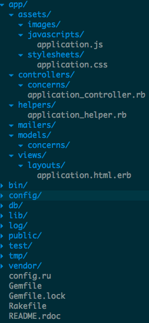

!SLIDE commandline incremental big
# rails command #
    $ gem install rails bundler
      Successfully installed rails-4.0.3
      1 gem installed

!SLIDE commandline incremental big
# rails command #
## creating new rails app ##
    $ rails new MyBlog
      create
      create  README.rdoc
      create  Rakefile
      create  config.ru
      create  .gitignore
      create  Gemfile
      create  app
      create  app/assets/javascripts/application.js
      create  app/assets/stylesheets/application.css
      create  app/controllers/application_controller.rb
      create  app/helpers/application_helper.rb
      create  app/views/layouts/application.html.erb
      create  app/assets/images/.keep
      create  app/mailers/.keep
      .
      .
      .

!SLIDE
## app structure ##

!SLIDE
## app structure ##
### database.yml ###

!SLIDE commandline incremental big
# rails command #
## starting rails server ##
    $ rails server
      => Booting WEBrick
      => Rails 4.0.3 application starting in development on http://0.0.0.0:3000
      => Run `rails server -h` for more startup options
      => Ctrl-C to shutdown server
      [2014-03-04 17:13:07] INFO  WEBrick 1.3.1
      [2014-03-04 17:13:07] INFO  ruby 2.0.0 (2013-06-27) [x86_64-darwin12.4.0]
      [2014-03-04 17:13:07] INFO  WEBrick::HTTPServer#start: pid=2867 port=3000

_rails s_

!SLIDE commandline incremental
# rails command #
## rails generator ##
    $ rails generate controller welcome index
      create  app/controllers/welcome_controller.rb
      route  get "welcome/index"
      invoke  erb
      create    app/views/welcome
      create    app/views/welcome/index.html.erb
      create    test/controllers/welcome_controller_test.rb
      create    app/helpers/welcome_helper.rb
      create      test/helpers/welcome_helper_test.rb
      invoke  assets
      invoke    coffee
      create      app/assets/javascripts/welcome.js.coffee
      invoke    scss
      create      app/assets/stylesheets/welcome.css.scss
_rails g_

!SLIDE incremental bullets
# Demo #
~~~SECTION:notes~~~

* show routes
* controller
* view

~~~ENDSECTION~~~

!SLIDE commandline incremental
# rails command #
## rails generator ##
    $ rails generate scaffold Book name:string author:string description:text
      invoke  active_record
      create    db/migrate/20140304172730_create_books.rb
      create    app/models/book.rb
      invoke    test_unit
      create      test/models/book_test.rb
      create      test/fixtures/books.yml
      invoke  resource_route
       route    resources :books
      invoke  scaffold_controller
      create    app/controllers/books_controller.rb
      invoke    erb
      create      app/views/books
      create      app/views/books/index.html.erb
      create      app/views/books/edit.html.erb
      create      app/views/books/show.html.erb
      create      app/views/books/new.html.erb
      create      app/views/books/_form.html.erb
_string_ datatype is optional

!SLIDE commandline incremental
# rails command #
## rails destroy ##
    $ rails destroy scaffold Book name:string author:string description:text
      invoke  active_record
      remove    db/migrate/20140304172730_create_books.rb
      remove    app/models/book.rb
      invoke    test_unit
      remove      test/models/book_test.rb
      remove      test/fixtures/books.yml
      invoke  resource_route
       route    resources :books
      invoke  scaffold_controller
      remove    app/controllers/books_controller.rb
      invoke    erb
      remove      app/views/books
      remove      app/views/books/index.html.erb
      remove      app/views/books/edit.html.erb
      remove      app/views/books/show.html.erb
      remove      app/views/books/new.html.erb
      remove      app/views/books/_form.html.erb
      invoke    test_unit
      remove      test/controllers/books_controller_test.rb
      invoke    helper
      remove      app/helpers/books_helper.rb
      invoke      test_unit
      remove        test/helpers/books_helper_test.rb
      invoke    jbuilder
      remove      app/views/books
      remove      app/views/books/index.json.jbuilder
      remove      app/views/books/show.json.jbuilder
