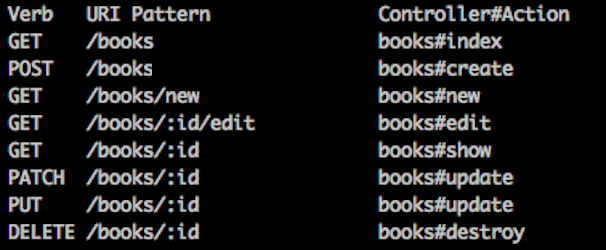

!SLIDE incremental commandline
# back to rails command #
    $ rails console
* _rails c_

!SLIDE incremental bullets small
# Rails Conventions #
* Controller names - plural
* Views inside - views/controller-name/action-name.html.erb
* Model name - singular
* Table name - plural
* _id_ primary key
* fields _created-at_, _updated-at_ added by default

!SLIDE incremental bullets
# RESTful Rails #
* REST is the underlying architectural principle of the web.
* Web is made of resources
* Resources manipulated by verbs - HTTP methods
* Representations - different
* Stateless

!SLIDE incremental bullets
# RESTful Rails #
* 

!SLIDE incremental bullets
# Routes #
* RESTful

!SLIDE incremental bullets
# Migrations #
* rails g migration

!SLIDE incremental bullets
# Models #
* ActiveRecord - ORM
* validations
* callbacks
* associations
* queries

!SLIDE incremental bullets
# Controllers #
* ActionController
* ApplicationController
* default actions
* adding new actions
* strong parameters
* filters

!SLIDE incremental bullets
# Views #
* erb
* layouts
* forms
* partials

